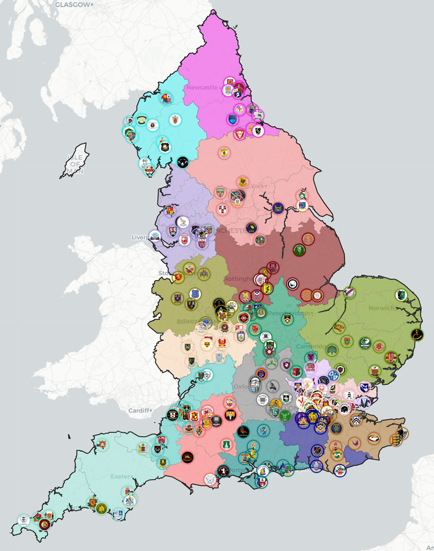

# English Rugby Union Team Mapping

Interactive maps showing the geographic distribution of English rugby union teams across tiers and counties.


_Map showing the teams/leagues in Counties 1 (level 7) in the 2025-2026 season_

## Setup

### Prerequisites

- Python 3.12+
- Make (optional, for pipeline commands)

### Installation

1. Clone or download this repository

2. Install Python dependencies:

```bash
pip install -r requirements.txt
```

Or with Make:

```bash
make install
```

3. (Optional) Install development tools for code formatting, linting and testing:

```bash
pip install -r requirements-dev.txt
pre-commit install
```

Or with Make:

```bash
make install-dev
```

This enables automatic code formatting on save (in VS Code) and before commits.

### Download Boundary Data

The project uses boundary data from the ONS Open Geography portal. Download the required files:

```bash
python download_boundaries.py
```

This downloads ITL1, ITL2, ITL3, and Countries boundaries to the `boundaries/` directory.

**Detail Level Options:**

- `--detail BGC` (default): Generalised Clipped - smaller files, faster download
- `--detail BFC`: Full Clipped - more detailed boundaries
- `--detail BSC`: Super Generalised - very simplified
- `--detail BUC`: Ultra Generalised - smallest files
- `--detail BFE`: Full Extent - most detailed, largest files

Example:

```bash
python download_boundaries.py --detail BFC
```

## Data Pipeline

Pre-computed geographic data for each league is included in `geocoded_teams/` as getting the data from the RFU can be difficult.

The project follows a multi-stage pipeline to collect and process team data. All commands support a `--season` parameter to specify which season to process (default: 2025-2026).

You can run the full pipeline with Make:

```bash
make all SEASON=2025-2026
```

Or run each step individually:

### 1. Scrape League Data

```bash
python scrape_leagues_teams.py --season 2025-2026
```

Scrapes the RFU website for all leagues and teams, saving to `league_data/[season]/` directory.
This step can fail due to rate-limiting / anti-bot detection.

**Options:**

- `--season YYYY-YYYY`: Season to scrape (e.g., 2024-2025, 2025-2026). Default: 2025-2026

### 2. Fetch Team Addresses

```bash
python fetch_addresses.py --season 2025-2026
```

Fetches physical addresses from RFU team profile pages. This step is free (no API calls) and caches results in `club_address_cache.json`.
This step can fail due to rate-limiting / anti-bot detection.

**Options:**

- `--season YYYY-YYYY`: Season to process. Default: 2025-2026
- `--workers N`: Max concurrent requests (default: 7)
- `--delay SECONDS`: Delay between requests (default: 2.0)
- `--retries N`: Max retries for failed requests (default: 3)
- `--league NAME`: Process only a single league

### 3. Geocode Addresses

```bash
python geocode_addresses.py --season 2025-2026
```

Converts addresses to coordinates using **OpenStreetMap Nominatim API** (free, no API key required).

**Options:**

- `--season YYYY-YYYY`: Season to process. Default: 2025-2026
- `--workers N`: Max concurrent geocoding requests (default: 10)
- `--google-retries N`: Retries for transient failures (default: 3)
- `--league NAME`: Process only a single league

### 4. Generate Maps

```bash
python make_tier_maps.py --season 2025-2026 --all-tiers
```

Creates all interactive maps with Voronoi diagrams.

**Options:**

- `--season YYYY-YYYY`: Season to process. Default: 2025-2026
- `--no-debug`: Exclude debug boundary layers (ITL1, ITL2, ITL3) for cleaner production maps
- `--tiers TIER [TIER ...]`: Generate specific tiers only (e.g., 'Premiership' 'Championship')
- `--mens`: Generate men's tier maps (individual)
- `--womens`: Generate women's tier maps (individual)
- `--all-tiers`: Generate all-tiers combined maps
- `--all-tiers-mens`: Generate men's all-tiers map only
- `--all-tiers-womens`: Generate women's all-tiers map only

**Features:**

- Team markers with RFU profile links and fallback logos
- Checkbox controls for showing/hiding leagues or tiers

## Routed Travel Distances (OSRM)

By default the pipeline uses straight-line (Haversine) distance for the
travel-distance figures shown on the maps. You can optionally upgrade this to
**real road distance and driving time** by building a single global routed
matrix once with [OSRM](https://project-osrm.org/) (OpenStreetMap routing).

The cache is **global, not per-season**: club locations are static across
seasons, so one file (`data/rugby/distance_cache/routed/all.npz` +
`all.json`, ~10 MB) covers every season — current and historical. It is
committed to the repo so most contributors never need to run OSRM at all.
The pipeline transparently falls back to Haversine for any pair of teams
that isn't in the cache.

### When to rebuild

Rebuild only when geocodes change, e.g.

- a brand-new club appears,
- an existing club moves grounds,
- you've added a new historical season under `geocoded_teams/`.

The build script logs a warning during `make distances` and `make
custom-map-data` if any current-season team is missing from the cache, so
you'll know when a refresh is due.

### One-off setup (WSL Ubuntu + Docker)

```bash
mkdir -p ~/osrm && cd ~/osrm
curl -fSL -o gb.osm.pbf https://download.geofabrik.de/europe/great-britain-latest.osm.pbf
docker run --rm -v "$PWD:/data" ghcr.io/project-osrm/osrm-backend \
    osrm-extract -p /opt/car.lua /data/gb.osm.pbf
docker run --rm -v "$PWD:/data" ghcr.io/project-osrm/osrm-backend \
    osrm-partition /data/gb.osrm
docker run --rm -v "$PWD:/data" ghcr.io/project-osrm/osrm-backend \
    osrm-customize /data/gb.osrm
docker run --rm -d -p 5000:5000 -v "$PWD:/data" ghcr.io/project-osrm/osrm-backend \
    osrm-routed --algorithm mld --max-table-size 5000 /data/gb.osrm
```

### Rebuild the cache

```bash
make routed-distances                            # uses OSRM_URL=http://localhost:5000
make routed-distances OSRM_URL=http://other:5000 # override
```

This walks every season under `geocoded_teams/`, dedupes to distinct
geocodes (rounded to 6 dp), calls OSRM `/table` in 256-point chunks, and
writes `data/rugby/distance_cache/routed/all.{npz,json}`. Takes roughly
40 seconds per ~1300 distinct points.

After rebuilding, regenerate downstream artifacts as usual:

```bash
make distances
make maps
make custom-map-data
```

The custom map's `dist/custom-map/distances.js` is ~8 MB raw and ships as
a base64-encoded Uint16 matrix. GitHub Pages serves `.js` gzipped
automatically (~3 MB on the wire), so no extra build step is required.

See `rugby/distances_routed.py` for full module-level documentation.

## Testing

Run the test suite:

```bash
python -m pytest tests/ -v
```

Or with Make:

```bash
make test
```

## Configuration

- **GA_TRACKING_ID**: Set this environment variable to enable Google Analytics on generated pages. Leave unset to disable tracking.

## File Structure

```
mapping/
├── README.md                      # This file
├── Makefile                       # Pipeline orchestration
├── requirements.txt               # Runtime dependencies
├── requirements-dev.txt           # Dev dependencies (linting, testing)
├── utils.py                       # Shared type definitions and utilities
├── tier_extraction.py             # Tier extraction logic
├── download_boundaries.py         # Download ONS boundary data
├── scrape_leagues_teams.py        # Scrape RFU for teams
├── fetch_addresses.py             # Fetch addresses from RFU
├── geocode_addresses.py           # Geocode with OpenStreetMap Nominatim
├── make_tier_maps.py              # Generate maps
├── team_pages.py                  # Generate individual team pages
├── generate_webpages.py           # Generate index pages
├── calculate_team_distances.py    # Calculate travel distances
├── tests/                         # Unit tests
│   ├── test_tier_extraction.py
│   ├── test_utils.py
│   ├── test_calculate_distances.py
│   └── test_team_pages.py
├── boundaries/                    # ONS boundary GeoJSON files (gitignored)
│   ├── ITL_1.geojson
│   ├── ITL_2.geojson
│   ├── ITL_3.geojson
│   └── countries.geojson
├── league_data/                   # Scraped league/team data
│   └── [season]/
│       └── [league].json
├── team_addresses/                # Team addresses from RFU
│   └── [season]/
│       └── [league].json
├── geocoded_teams/                # Geocoded team coordinates
│   └── [season]/
│       └── [league].json
└── tier_maps/                     # Generated HTML maps (gitignored)
    └── [season]/
        ├── Counties_1.html
        ├── Counties_2.html
        ├── ...
        └── All_Tiers.html
```

## Multi-Season Support

All data and outputs are organized by season. To work with a different season:

1. Scrape data for the desired season:

   ```bash
   python scrape_leagues_teams.py --season 2024-2025
   ```

2. Process the data through the pipeline with the same `--season` parameter

3. Data from different seasons is kept separate in season-specific subdirectories, allowing you to:
   - Compare team distributions across seasons
   - Track changes in league structures
   - Generate historical maps

## License & Data Sources

- **Boundary Data**: © Crown copyright and database rights, Office for National Statistics
- **Boundary Data (Isle of Man and Channel Islands)**: Database of Global Administrative Areas (GADM)
- **Team Data**: Scraped from England Rugby (RFU) website
- **Geocoding**: OpenStreetMap contributors
- **Map Tiles**: © OpenStreetMap contributors, © CartoDB (Positron / Dark Matter basemaps).
